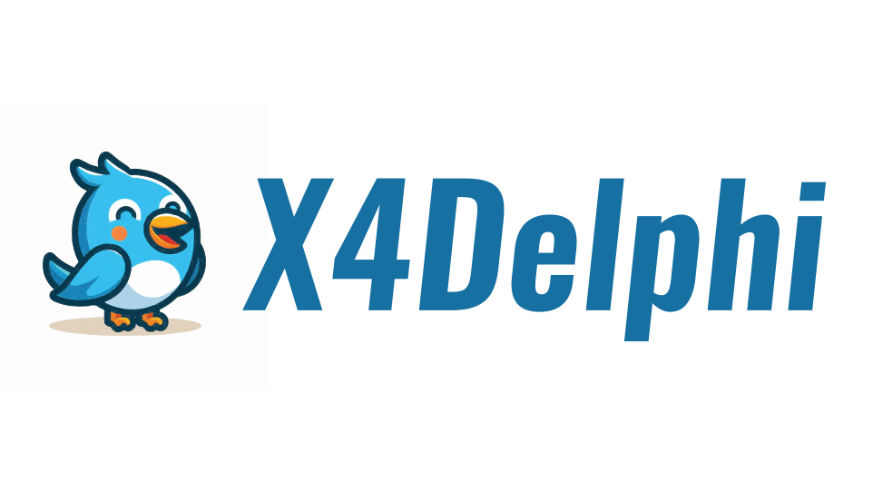

# X4Delphi Component v 1.1.0



## New Update 1.1.0 
- You can now Sign with Twitter easily !       


## Introduction
This is a Delphi Component for interacting with  X ( Twitter ) API. It provides a set of functions to perform various actions.

- **Compatibility:** VCL, FMX
- **Tested on Delphi:** 11 Alexandria CE
- **Version:** 1.1.0 
- **Developer:** Silas AÏKO 

## Getting Started
To use this component in your Delphi project, follow these steps:

### Clone or Download the Library Source Code:

1. Clone the component repository or download the source code as a ZIP file from the [GitHub repository](https://github.com/aso14/Twitter.git).
2. Unzip the files into a directory of your choice.

### Configure RAD Studio Library Paths:

1. Open RAD Studio and navigate to "Tools > Options... > Language > Delphi."
2. Under the "Library" section, add the "\Sources" path from the library source code to the library paths for each platform you want to compile.

### Compile and Install the Package:

1. Open the `Twitter.dproj` file located in the "Package" folder of the component source code.
2. Compile and install the package `Twitter.bpl`. This step may involve right-clicking on the project file and selecting "Compile" and then "Install."

## Available Functions
#
#

| Procedure / Function                   | Description                                          | Example Usage
|-----------------------------|------------------------------------------------------|--------------
| **CreateTweet**                   | This procedure allows you to create a tweet on Twitter. Simply provide the text you want to tweet, and it returns a response through **OnAuthenticated** Event containing relevant information about the tweet. | `Twitter1.CreateTweet('Hello, Twitter!');`
| **DeleteTweet**                  | With this function, you can delete a tweet from Twitter by providing its ID (AId). It returns a response object (TTweetRespDeleted) indicating the success or failure of the deletion operation.| ` Resp := Twitter1.DeleteTweet(TweetId);`
| **CreateTweetWithContent**             | This procedure enables you to create a tweet with both text and media content (such as images or videos). | `Twitter1.CreateTweetWithContent('AText','Images_videos_path');`
| **SignIn**             | This procedure enables you to use Log in with Twitter based on OAuth | `Twitter1.SignIn;`

## Examples for Available Functions

### Set up your Twitter Developer account
You need to create a developers account :
- How Create a developers account : https://developer.twitter.com/en/portal/dashboard
  You need to create a developers account :
- Access Token; Bearer Token; Consumer Key; Consumer Secret; Token Secret; 

### CreateTweet
This procedure allows you to create a tweet on Twitter.
```delphi
Twitter1.CreateTweet('Hello, Twitter!');
```
Event : OnTweetSent
```delphi
procedure TForm1.Twitter1TweetSent(ATweetId, ATweet: string);
begin
// Write your code here.....
end;
```

### DeleteTweet
With this function, you can delete a tweet from Twitter by providing its ID (AId).
```delphi
var Resp := Twitter1.DeleteTweet(Resp.data.id);
```

### CreateTweetWithContent
This procedure enables you to create a tweet with both text and media content (such as images or videos).
```delphi
Twitter1.CreateTweetWithContent('AText','Images_videos_path');
```
Event : OnTweetSentWithContent
```delphi
procedure TForm1.Twitter1TweetSentWithContent(ATweetMediaId: string);
begin
// Write your code here.....
end;
```
### SignIn
Log in with Twitter.
```delphi
Twitter1.SignIn;
```
Event : OnAuthenticated
```delphi
procedure TForm1.Twitter1Authenticated(AIsAuth: Boolean);
begin
 // Write your code here.....
end;
```

## License
This library is released under the [MIT License](LICENSE).

Feel free to contribute, open issues, or provide feedback!
